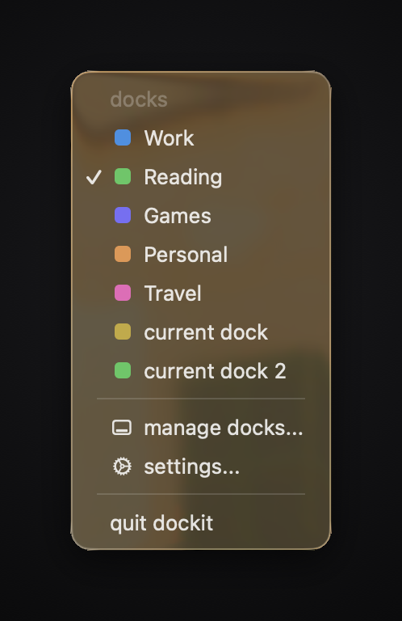
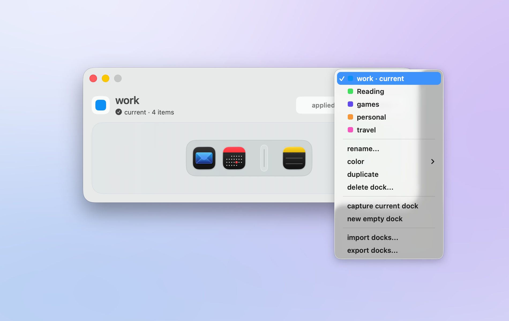
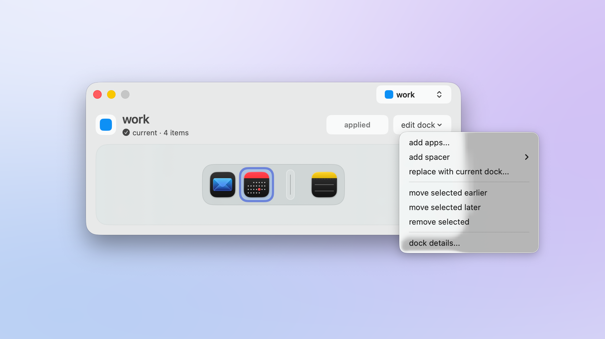
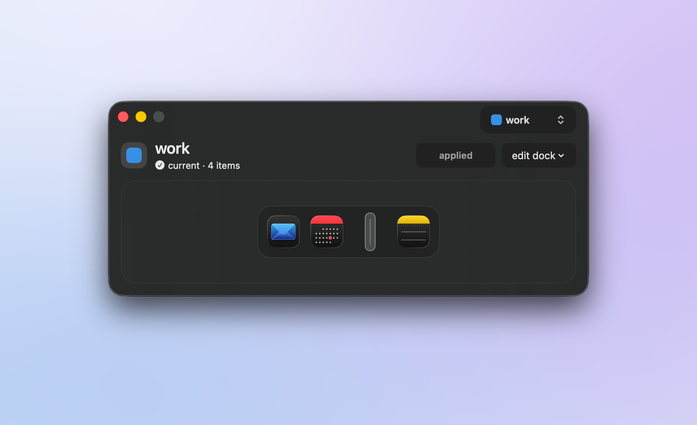

<p align="center">
  
</p>

<h1 align="center">dockit</h1>

<p align="center">
  Saved Dock layouts for macOS. Keep one Dock for work, one for reading, one for games, and switch between them from the menu bar or with a Focus.
</p>

<p align="center">
  
</p>

<p align="center">
  <a href="https://github.com/advegaf/dockit/releases/latest"></a>
</p>

<p align="center">
  <sub>Signed, notarized, and free. Requires macOS 26.</sub>
</p>

dockit edits the real macOS Dock. It is not a replacement Dock and it draws
nothing on top of it. A profile is a list of pinned apps and spacers. Applying
one writes that list into the Dock's preferences and restarts the Dock so it
picks the list up. Everything else about your Dock stays as you set it: folders,
recents, size, position, hiding.

## Install

Open the disk image and drag dockit into Applications. It is signed with a
Developer ID and notarized by Apple, so it opens on a normal double click, and
there is no Gatekeeper detour to explain to anyone.

There is no Homebrew cask yet.

Requires macOS 26.

<p align="center">
  
</p>

<p align="center">
  
</p>

The quick guide opens once, after the first profile is saved, and again from
Help, quick guide. It covers the four things there are to do: pick a profile,
arrange it, apply it, and switch from the menu bar.

<p align="center">
  
</p>

The menu bar menu is a plain native menu: every profile, the active one checked,
then manage docks, settings, and quit.

The editor is one window. A profile picker sits in the title bar, then the
profile's name and status, the apply button, and a preview of the Dock it will
produce. Selecting a profile only inspects it, and nothing touches the Dock
until you apply. A Focus filter (System Settings, Focus, add a filter, dockit)
applies a profile when that Focus turns on and leaves the Dock alone when it
turns off.

<p align="center">
  
</p>

<p align="center">
  
</p>

<p align="center">
  
</p>

<p align="center">
  
</p>

## Build it yourself

Requires Xcode 26 and [xcodegen](https://github.com/yonaskolb/XcodeGen).

```sh
xcodegen generate
xcodebuild -project Dockit.xcodeproj -scheme Dockit -configuration Debug build
```

Tests run in three lanes:

```sh
swift test                                    # DockitCore
xcodebuild test -project Dockit.xcodeproj -scheme DockitAppTests
node --test Tools/*Tests.mjs                  # timing evaluator, feature ledger, reference video
```

The real Dock probe in `Tools/run-dock-probe.sh` mutates your actual Dock. It
backs it up first and restores it. Read the script before running it.

`Tools/Screenshots/make-docs-images.sh` regenerates the hero, the editor, the
settings page, the guide, the logo and the download button. The remaining four
images on this page came out of the article pass in
`Tools/Screenshots/ArticleImages.swift`, which composites captures rather than
taking them, and `menu.png` is hand-taken because `screencapture` cannot image a
pop-up menu window at all.

`Tools/Release/release.sh` builds a release: archive, Developer ID export,
notarize, staple, disk image, notarize the image, staple it. Every gate has to
pass before anything reaches `dist/`, and `Tools/Release/publish.sh` refuses to
publish a disk image that is not stapled.

## Layout

```
Sources/DockitCore         profiles, Dock preferences, restart, verification, recovery
Sources/Dockit             the app: editor, settings, menu bar, Focus bridge
Sources/DockitFocusExtension   the Focus filter intent
Tests/                     core (swift-testing) and app (XCTest, test host) suites
Tools/DockProbe.swift      real Dock probe and reload experiments
Tools/Screenshots/         the screenshot and article image pipeline
Tools/Release/             signing, notarization, DMG, GitHub release
Design/                    app icon source and installer artwork
docs/                      reviews and the feature ledger
```

## Credit

Built by [Angel Vega](https://github.com/advegaf).

## Licence

MIT. See [LICENSE](LICENSE).
