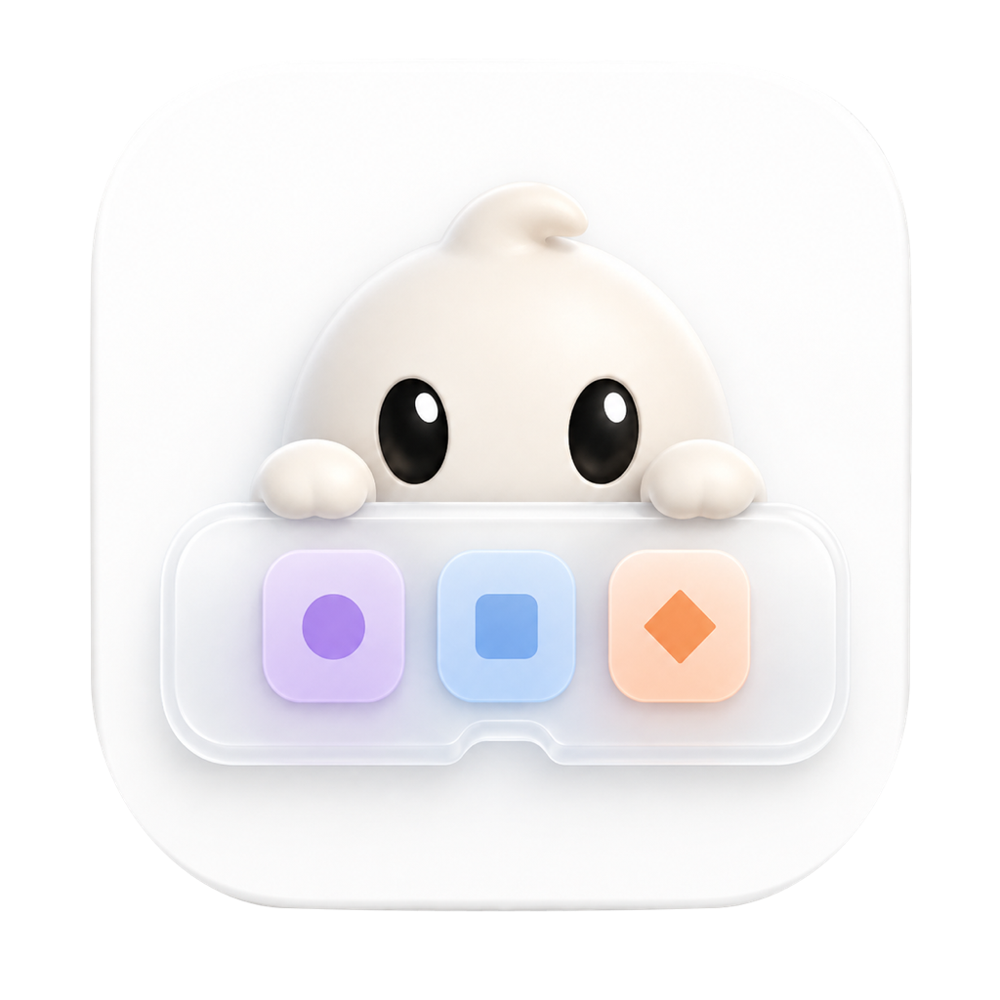
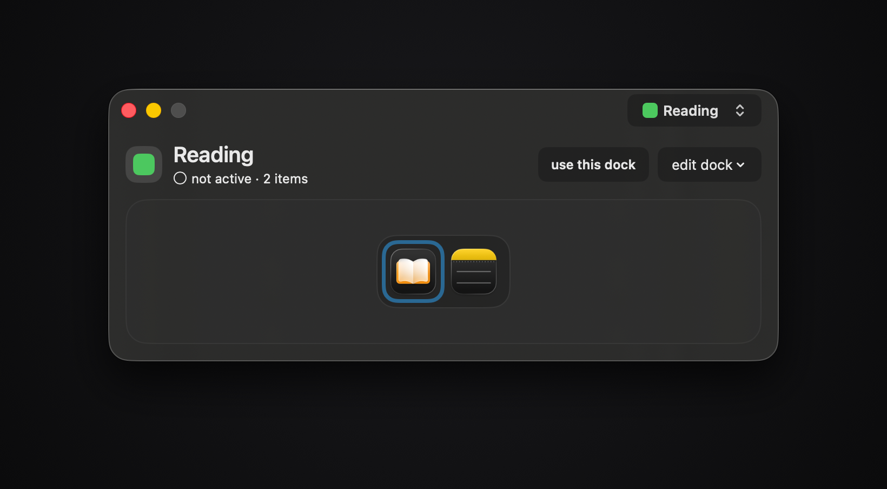
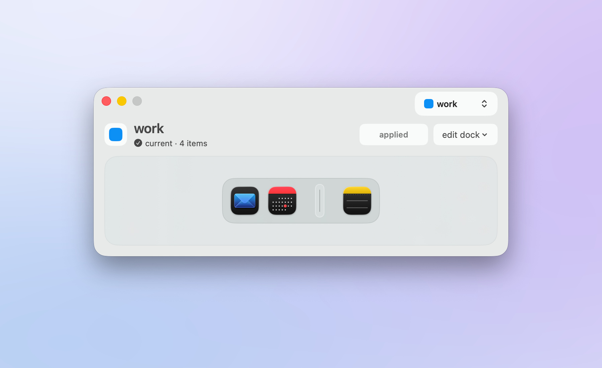
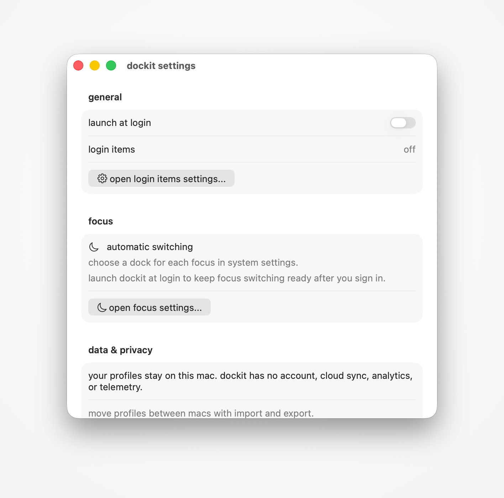
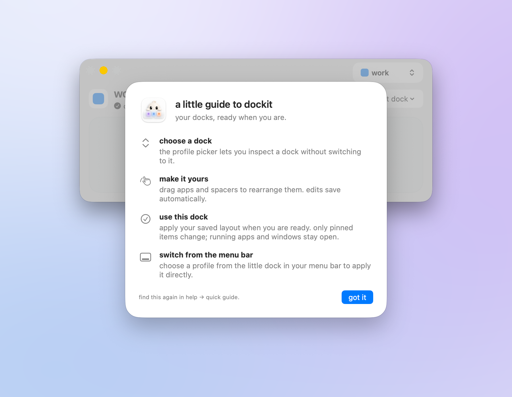

<p align="center">
  
</p>

<h1 align="center">dockit</h1>

<p align="center">
  Saved Dock layouts for macOS. Keep one Dock for work, one for reading, one for games, and switch between them from the menu bar or with a Focus.
</p>

<table>
  <tr>
    <td></td>
    <td></td>
  </tr>
</table>

dockit edits the real macOS Dock. It is not a replacement Dock and it draws nothing on top of it. A profile is a list of pinned apps and spacers. Applying a profile writes that list into the Dock's preferences and restarts the Dock so it picks the list up. Everything else about your Dock (folders, recents, size, position, hiding) stays as you set it.

<p align="center">
  
</p>

<p align="center">
  
</p>

The quick guide opens once, after the first profile is saved, and again from Help, quick guide. It covers the four things there are to do: pick a profile, arrange it, apply it, and switch from the menu bar.

The editor is one window: a profile picker in the title bar, the profile's name and status, the apply button, and a preview of the Dock it will produce. Selecting a profile only inspects it. Nothing touches the Dock until you apply. The menu bar menu is a plain native menu that lists every profile and marks the active one. A Focus filter (System Settings, Focus, add a filter, dockit) applies a profile when that Focus turns on and leaves the Dock alone when it turns off.

## Why the Dock restarts

macOS has no supported way to reload pinned Dock items without restarting the Dock process. Posting the `com.apple.dock.prefchanged` notification after writing `persistent-apps` does nothing for pinned items; the Dock keeps showing the old layout with the new preferences on disk. Firefox's own "add to Dock" code and dockutil restart the Dock for the same reason, so dockit does too.

How the Dock is killed matters. `NSRunningApplication.forceTerminate()`, a graceful quit, and SIGTERM all let the Dock run for about 250 ms first, and in that time the Dock writes its in-memory pinned apps back over whatever dockit just wrote. That is why a second switch within a few seconds of the first used to fail. dockit sends SIGKILL instead: measured on macOS 26.4 the Dock is gone in under 10 ms, launchd has the new one running about 50 ms later, and the Dock strip is off screen for two frames at 60 fps.

The part people notice is not the Dock strip. The Dock process also owns the desktop wallpaper window, so every display goes black for about 70 ms until the new Dock draws the wallpaper again. dockit covers that: just before the kill it puts a borderless window on each screen at the desktop level showing the same wallpaper image, and takes it down once the new Dock has its wallpaper window up. The kill waits until the cover is on screen plus 200 ms, so the menu bar's translucent backdrop has already settled on the cover. Recorded at 30 fps, a switch with the cover has no black frame. The cover reads the wallpaper file macOS reports for the screen, and when that file is gone it reads the copy macOS made of it when it was chosen (the wallpaper extension keeps one for every file wallpaper, and that copy is what the Dock renders). An aerial or a dynamic set has no file to load; then dockit copies the wallpaper from the screen instead, but only if you have already given it Screen Recording in Privacy and Security. dockit never asks for that permission. Without either, that screen keeps its short flash.

Compared with dockutil, which edits one item at a time from a shell and needs the same restart, dockit keeps whole layouts, verifies the Dock matches after every switch, rolls back when it does not, and recovers a switch that was interrupted mid-way.

## Build

Requires Xcode 26 and [xcodegen](https://github.com/yonaskolb/XcodeGen).

```sh
xcodegen generate
xcodebuild -project Dockit.xcodeproj -scheme Dockit -configuration Debug build
```

Tests run in three lanes:

```sh
swift test                                    # DockitCore
xcodebuild test -project Dockit.xcodeproj -scheme DockitAppTests
node --test Tools/*Tests.mjs                  # timing evaluator, feature ledger, reference video
```

The real Dock probe in `Tools/run-dock-probe.sh` mutates your actual Dock, backs it up first, and restores it. Read the script before running it.

## Layout

```
Sources/DockitCore         profiles, Dock preferences, restart, verification, recovery
Sources/Dockit             the app: editor, settings, menu bar, Focus bridge
Sources/DockitFocusExtension   the Focus filter intent
Tests/                     core (swift-testing) and app (XCTest, test host) suites
Tools/DockProbe.swift      real Dock probe and reload experiments
Tools/Screenshots/         the README screenshot pipeline
Tools/Release/             signing, notarization, DMG, GitHub release
Design/                    app icon source and installer artwork
docs/                      reviews and the feature ledger
```

## Screenshots

`Tools/Screenshots/make-docs-images.sh` regenerates every image in `docs/images/`. Each shot is the real window captured through the window server with its own shadow, then placed on a plain backdrop. The app runs in demo mode for every shot, so the real Dock is never touched.

## Release

`Tools/Release/release.sh all` archives, exports with Developer ID, notarizes, staples, and packages `dist/dockit-<version>.dmg`. `Tools/Release/publish.sh <notes.md>` tags the version and creates the GitHub release with that DMG. Details in `Tools/Release/DMG.md`.

## License

MIT. See LICENSE.
